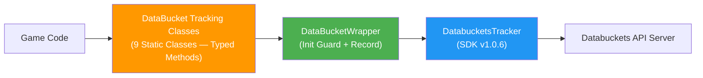
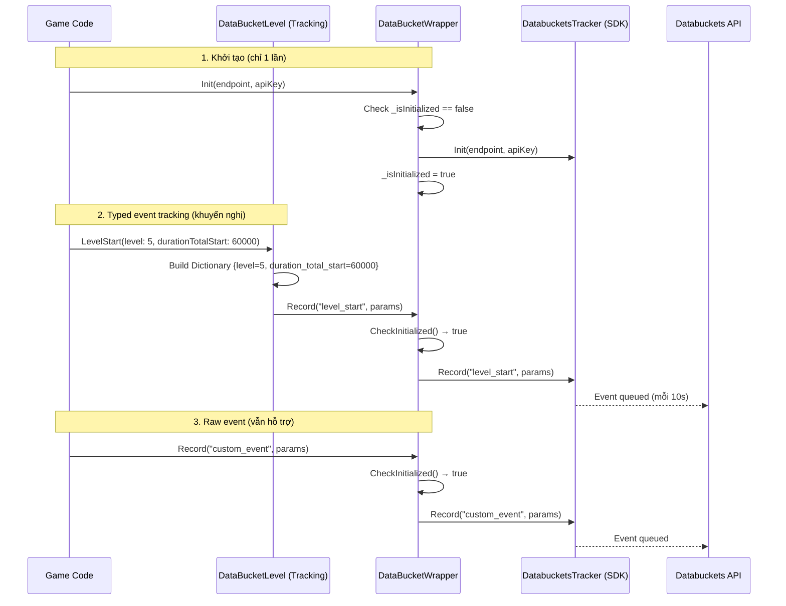

# System Design Document — DataBucketPlugin

<a id="research-arch-design-plugin-0001"></a>

`research:arch-design-plugin-0001`
> Implements: [`prd:tech-stack-0002`](../PRDs/PRD-002.md#prd-tech-stack-0002), [`prd:tech-stack-0003`](../PRDs/PRD-003.md#prd-tech-stack-0003)

---

## 1. Tổng quan kiến trúc

DataBucketPlugin gồm **2 layer** nằm giữa game code và Databuckets SDK:

1. **Tracking Layer** — 9 static classes cung cấp typed methods cho từng nhóm event
2. **Wrapper Layer** — `DataBucketWrapper` cung cấp Init guard và error logging



**Luồng gọi API (2 cách):**

**Cách 1 — Typed (khuyến nghị):**
1. Game code gọi `DataBucketLevel.LevelStart(level: 5, ...)`
2. Tracking class build `Dictionary<string, object>` từ typed params
3. Gọi `DataBucketWrapper.Record("level_start", params)`
4. Wrapper kiểm tra `_isInitialized` → forward sang SDK

**Cách 2 — Raw (vẫn hỗ trợ):**
1. Game code gọi trực tiếp `DataBucketWrapper.Record("level_start", params)`
2. Wrapper kiểm tra `_isInitialized` → forward sang SDK

---

## 2. Module/Component Design

### 2.1 Cấu trúc thư mục

```
Assets/DataBucketPlugin/
├── Scripts/
│   ├── DataBucketWrapper.cs               ← Wrapper class (Init guard + Record)
│   ├── DataBucketUserProperties.cs        ← User property setters
│   ├── DataBucketLevel.cs                 ← Level analytics events
│   ├── DataBucketResource.cs              ← Resource earn/spend events
│   ├── DataBucketIAP.cs                   ← IAP tracking events
│   ├── DataBucketAd.cs                    ← IAA (Ad) tracking events
│   ├── DataBucketNotification.cs          ← Notification events
│   ├── DataBucketLiveOps.cs               ← Live Ops feature events
│   ├── DataBucketMetrics.cs               ← Other metrics events
│   └── DataBucketTechnical.cs             ← Technical performance events
├── Documents/
│   ├── README.md                          ← Hướng dẫn sử dụng
│   ├── CHANGE_LOG.md                      ← Lịch sử thay đổi
│   └── DATA_TRACKING_GUIDE.md            ← Chi tiết Trigger/KPI/Values/Requirement
└── Samples/
    └── DataBucketWrapperSample.cs         ← MonoBehaviour test script
```

### 2.2 Class Diagram

```mermaid
classDiagram
    class DataBucketWrapper {
        -bool _isInitialized$
        +Init(string apiEndpoint, string apiKey)$
        +Record(string eventName, Dictionary params)$
        +RecordWithTiming(...)$
        +SetCommonProperty(string key, object value)$
        +SetCommonProperties(Dictionary properties)$
        +ForceEndSession()$
        +EnableExceptionTracking()$
        +DisableExceptionTracking()$
        -CheckInitialized(string methodName)$ bool
    }

    class DataBucketUserProperties {
        +SetCurrentLevel(int level)$
        +SetUaAttribution(...)$
        +SetFirebaseExp(string[] experiments)$
        +SetResourceBalance(string name, int balance)$
        +SetUserId(string userId)$
        +SetCurrentMode(string mode)$
        +SetIsIapUser(bool isIapUser)$
        +SetActiveDay(int day)$
        +SetConnectionType(string type)$
        +SetWinStreak(int count)$
        +SetLoseStreak(int count)$
    }

    class DataBucketLevel {
        +LevelStart(int level, long durationTotalStart, ...)$
        +LevelEnd(int level, string result, long durationPlay, ...)$
        +LevelExit(int level, ...)$
        +LevelReopen(int level, ...)$
    }

    class DataBucketResource {
        +Earn(string type, string name, object amount, ...)$
        +Spend(string type, string name, object amount, ...)$
    }

    class DataBucketIAP {
        +Show(string placement, string showType, ...)$
        +Click(string placement, string showType, ...)$
        +PurchaseSuccess(string placement, ..., double price)$
        +PurchaseFailed(string placement, ..., string failReason)$
        +Close(string placement, ..., long durationIap)$
    }

    class DataBucketAd {
        +Request(string adFormat, ..., int isLoad, long loadTime)$
        +Impression(string adFormat, ..., double value)$
        +Click(string adFormat, ...)$
        +Complete(string adFormat, ..., string endType)$
    }

    class DataBucketNotification {
        +Send(string notiCate, string notiName)$
        +Receive(string notiCate, string notiName)$
        +Open(string notiCate, string notiName)$
    }

    class DataBucketLiveOps {
        +FeatureFirstShow(string featureName, ...)$
        +FeatureOpen(string featureName, ...)$
        +FeatureClose(string featureName, ...)$
    }

    class DataBucketMetrics {
        +TutorialAction(string actionName, int actionIndex, ...)$
        +ButtonClick(string buttonName, string screenName)$
        +ScreenShow(string screenName, ...)$
        +ScreenExit(string prevScreenName, ...)$
    }

    class DataBucketTechnical {
        +LoadingStart(string dataSource, string resourceType, ...)$
        +LoadingFinish(string dataSource, ..., string result, long loadTime)$
    }
    
    class DatabucketsTracker {
        +Init(string apiEndpoint, string apiKey)$
        +Record(string eventName, Dictionary params)$
        +RecordWithTiming(...)$
        +SetCommonProperty(string key, object value)$
        +SetCommonProperties(Dictionary properties)$
        +ForceEndCurrentSession()$
        +EnableExceptionLogTracking()$
        +DisableExceptionLogTracking()$
    }
    
    DataBucketUserProperties ..> DataBucketWrapper : uses SetCommonProperty
    DataBucketLevel ..> DataBucketWrapper : uses Record
    DataBucketResource ..> DataBucketWrapper : uses Record
    DataBucketIAP ..> DataBucketWrapper : uses Record
    DataBucketAd ..> DataBucketWrapper : uses Record
    DataBucketNotification ..> DataBucketWrapper : uses Record
    DataBucketLiveOps ..> DataBucketWrapper : uses Record
    DataBucketMetrics ..> DataBucketWrapper : uses Record
    DataBucketTechnical ..> DataBucketWrapper : uses Record
    DataBucketWrapper ..> DatabucketsTracker : delegates to
```



### 2.3 Interface/Contract — Wrapper Layer

| Method | Parameters | Return | Guard |
|--------|-----------|--------|-------|
| `Init` | `apiEndpoint`, `apiKey` | void | Warn nếu đã Init |
| `Record` | `eventName`, `eventParams` | void | Error nếu chưa Init |
| `RecordWithTiming` | `eventName`, `eventParams`, `timingProperty`, `startEvent` | void | Error nếu chưa Init |
| `SetCommonProperty` | `key`, `value` | void | Error nếu chưa Init |
| `SetCommonProperties` | `properties` | void | Error nếu chưa Init |
| `ForceEndSession` | — | void | Error nếu chưa Init |
| `EnableExceptionTracking` | — | void | Error nếu chưa Init |
| `DisableExceptionTracking` | — | void | Error nếu chưa Init |

### 2.4 Interface/Contract — Tracking Layer

| Class | Events | Pattern |
|-------|--------|---------|
| `DataBucketUserProperties` | — (SetCommonProperty) | Typed setter → `DataBucketWrapper.SetCommonProperty()` |
| `DataBucketLevel` | level_start, level_end, level_exit, level_reopen | Typed params → `DataBucketWrapper.Record()` |
| `DataBucketResource` | resource_earn, resource_spend | Typed params → `DataBucketWrapper.Record()` |
| `DataBucketIAP` | iap_show, iap_click, iap_purchase_success, iap_purchase_failed, iap_close | Typed params → `DataBucketWrapper.Record()` |
| `DataBucketAd` | ad_request, ad_impression, ad_click, ad_complete | Typed params → `DataBucketWrapper.Record()` |
| `DataBucketNotification` | noti_send, noti_receive, noti_open | Typed params → `DataBucketWrapper.Record()` |
| `DataBucketLiveOps` | feature_first_show, feature_open, feature_close | Typed params → `DataBucketWrapper.Record()` |
| `DataBucketMetrics` | tutorial_action, button_click, screen_show, screen_exit | Typed params → `DataBucketWrapper.Record()` |
| `DataBucketTechnical` | loading_start, loading_finish | Typed params → `DataBucketWrapper.Record()` |

**Quy ước chung cho Tracking Layer:**
- Optional params dùng default value `null` → Nếu null thì KHÔNG thêm vào Dictionary
- Number type: `int` cho counts/indices, `long` cho durations (msec), `double` cho price/value
- XML `<summary>` ngắn gọn trong code + chi tiết tại `DATA_TRACKING_GUIDE.md`

---

## 3. Data Flow



---

## 4. Quy ước kỹ thuật

- **Namespace:** `DataBucketPlugin`
- **Naming:** PascalCase cho public methods, _camelCase cho private fields
- **Class prefix:** Tất cả class bắt đầu bằng `DataBucket`
- **Error Handling:** `Debug.LogError("[DataBucketWrapper] ...")` prefix thống nhất
- **Warning:** `Debug.LogWarning("[DataBucketWrapper] ...")` cho Init trùng lặp
- **Log format:** `[DataBucketWrapper] {MethodName}: {message}`
- **Tracking log format:** `[DataBucket{ClassName}] {MethodName}: {message}`

---

## 5. Rủi ro kỹ thuật

| # | Rủi ro | Impact | Likelihood | Mitigation |
|---|--------|--------|------------|------------|
| 1 | SDK gốc thay đổi API signature | H | L | Wrapper isolate thay đổi, chỉ sửa 1 file |
| 2 | Developer quên gọi Init | M | M | Wrapper tự động log error rõ ràng |
| 3 | Init state không reset khi reload scene | L | L | Đây là hành vi mong muốn — Init chỉ gọi 1 lần |
| 4 | Event name/param name sai so với Tracking Plan | H | M | Typed methods loại bỏ typo, DATA_TRACKING_GUIDE.md tham chiếu |
| 5 | Nhiều class gây khó tìm method | L | L | Prefix `DataBucket` + IntelliSense + README |

---

## 6. Danh mục Technology Stack

| Layer | Technology | Version | Lý do chọn |
|-------|------------|---------|------------|
| Language | C# | — | Unity standard |
| Engine | Unity | — | Target platform |
| SDK | Databuckets SDK | v1.0.6 | Analytics platform |
| Pattern | Static Class | — | Nhất quán với SDK gốc |
| Documentation | XML Comments + Markdown | — | IntelliSense + detailed guide |
