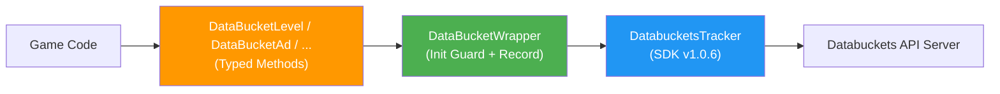

# Product Requirements Document (PRD): DataBucketTracking — Event Tracking Helper

> **Quy ước ID:** Xem chi tiết tại [docs/ID-CONVENTION.md](../ID-CONVENTION.md)

---

<a id="prd-tracking-helper-0001"></a>

## 1. Tổng quan

`prd:tracking-helper-0001`

Tạo bộ **DataBucket Tracking Classes** — các static helper class cung cấp **typed methods** cho từng event trong Data Tracking Plan (Level-base). Mỗi nhóm event được tách thành **1 class riêng**, prefix `DataBucket`, sử dụng `DataBucketWrapper.Record()` và `DataBucketWrapper.SetCommonProperty()` bên dưới.

- **Đối tượng sử dụng:** Unity developers cần log analytics events
- **Nền tảng:** Unity (C#)
- **Dependency:** `DataBucketWrapper` (đã có trong `DataBucketPlugin`)
- **Version:** 1.0.1
- **Namespace:** `DataBucketPlugin`
- **Tham chiếu nguồn:** Sheet "Data Tracking Plan | Level-base"

### Mục tiêu chính

1. **Typed methods** — Developer không cần nhớ tên event hay key params
2. **Tách class theo nhóm** — Dễ kiểm soát, maintain, mở rộng
3. **Documentation kết hợp** — XML comments (IntelliSense) + file .md chi tiết (Trigger, KPI, Value Requirement)
4. **Null = không gửi** — Optional params null thì không thêm vào Dictionary

### Kiến trúc layer



---

<a id="prd-tech-stack-0003"></a>

## 2. Yêu cầu kỹ thuật

`prd:tech-stack-0003`

- **Ngôn ngữ:** C#
- **Framework:** Unity Engine
- **Kiểu class:** Static class (mỗi nhóm event = 1 class)
- **Namespace:** `DataBucketPlugin`
- **Naming convention:** Class prefix `DataBucket`, method = PascalCase, param key = snake_case
- **Documentation:** Option C — XML `<summary>/<param>/<remarks>` + `DATA_TRACKING_GUIDE.md`

### Cấu trúc thư mục (cập nhật)

```
Assets/DataBucketPlugin/
├── Scripts/
│   ├── DataBucketWrapper.cs                ← [EXISTING] Wrapper class chính
│   ├── DataBucketUserProperties.cs         ← [NEW] User property setters
│   ├── DataBucketLevel.cs                  ← [NEW] Level analytics events
│   ├── DataBucketResource.cs               ← [NEW] Resource earn/spend events
│   ├── DataBucketIAP.cs                    ← [NEW] IAP tracking events
│   ├── DataBucketAd.cs                     ← [NEW] IAA (Ad) tracking events
│   ├── DataBucketNotification.cs           ← [NEW] Notification events
│   ├── DataBucketLiveOps.cs                ← [NEW] Live Ops feature events
│   ├── DataBucketMetrics.cs                ← [NEW] Other metrics events
│   └── DataBucketTechnical.cs              ← [NEW] Technical performance events
├── Documents/
│   ├── README.md                           ← [UPDATE] Thêm hướng dẫn tracking classes
│   ├── CHANGE_LOG.md                       ← [UPDATE] Version 1.1.0
│   └── DATA_TRACKING_GUIDE.md             ← [NEW] Chi tiết Trigger/KPI/Values/Requirement
└── Samples/
    └── DataBucketWrapperSample.cs          ← [UPDATE] Thêm sample tracking calls
```

### 9 Classes tổng quan

| # | Class | Events | Mô tả |
|---|-------|--------|-------|
| 1 | `DataBucketUserProperties` | — (SetCommonProperty) | Setter cho user properties |
| 2 | `DataBucketLevel` | level_start, level_end, level_exit, level_reopen | Level analytics |
| 3 | `DataBucketResource` | resource_earn, resource_spend | Resource earn/spend |
| 4 | `DataBucketIAP` | iap_show, iap_click, iap_purchase_success, iap_purchase_failed, iap_close | IAP flow |
| 5 | `DataBucketAd` | ad_request, ad_impression, ad_click, ad_complete | In-App Advertising |
| 6 | `DataBucketNotification` | noti_send, noti_receive, noti_open | Push notifications |
| 7 | `DataBucketLiveOps` | feature_first_show, feature_open, feature_close | Live Ops features |
| 8 | `DataBucketMetrics` | tutorial_action, button_click, screen_show, screen_exit | Other metrics |
| 9 | `DataBucketTechnical` | loading_start, loading_finish | Technical performance |

---

<a id="feature-user-properties-0010"></a>

## 3. Tính năng (Features)

### 3.1. DataBucketUserProperties

`feature:user-properties-0010`
> Implements: [`prd:tracking-helper-0001`](#prd-tracking-helper-0001)

User properties — không phải event, gọi `SetCommonProperty()` bên dưới.

| Method | Property Key | Data Type |
|--------|-------------|-----------|
| `SetCurrentLevel(int level)` | current_level | Number |
| `SetUaAttribution(...)` | ua_network, ua_campaign, ua_adgroup, ua_creative, ua_tracker_name | String |
| `SetFirebaseExp(string[] experiments)` | firebase_exp | Array |
| `SetResourceBalance(string resourceName, int balance)` | balance_{resource}_n | Number |
| `SetUserId(string userId)` | user_id | String |
| `SetCurrentMode(string mode)` | current_mode | String |
| `SetCurrentEvent(string eventName)` | current_event | String |
| `SetIsIapUser(bool isIapUser)` | is_iap_user_n | Number (0/1) |
| `SetIapCount(int count)` | iap_count_n | Number |
| `SetActiveDay(int day)` | active_day_n | Number |
| `SetConnectionType(string type)` | connection_type | String |
| `SetWinStreak(int count)` | win_streak_n | Number |
| `SetLoseStreak(int count)` | lose_streak_n | Number |

---

<a id="feature-level-analytics-0011"></a>

### 3.2. DataBucketLevel

`feature:level-analytics-0011`
> Implements: [`prd:tracking-helper-0001`](#prd-tracking-helper-0001)

| Method | Event Name | Required Params | Optional Params |
|--------|-----------|-----------------|-----------------|
| `LevelStart(int level, long durationTotalStart, ...)` | `level_start` | level, duration_total_start | loop_by, play_type, play_index, lose_index, mode |
| `LevelEnd(int level, string result, long durationPlay, ...)` | `level_end` | level, result, duration_play | lose_by, loop_by, play_type, play_index, lose_index, duration_total_start, duration_total_end, duration_remain, items_total, items_cleared, action_seq, mode |
| `LevelExit(int level, ...)` | `level_exit` | level | loop_by, play_type, play_index, lose_index, exit_index, duration_total_start, duration_total_end, duration_remain, duration_play, items_total, items_cleared, action_seq, mode |
| `LevelReopen(int level, ...)` | `level_reopen` | level | loop_by, play_index, lose_index, duration_total_start, mode |

---

<a id="feature-resource-analytics-0012"></a>

### 3.3. DataBucketResource

`feature:resource-analytics-0012`
> Implements: [`prd:tracking-helper-0001`](#prd-tracking-helper-0001)

| Method | Event Name | Required Params | Optional Params |
|--------|-----------|-----------------|-----------------|
| `Earn(...)` | `resource_earn` | resource_type, resource_name, resource_amount, placement, reason | placement_detail, resource_balance |
| `Spend(...)` | `resource_spend` | resource_type, resource_name, resource_amount, reason, placement | placement_detail, resource_balance |

---

<a id="feature-iap-tracking-0013"></a>

### 3.4. DataBucketIAP

`feature:iap-tracking-0013`
> Implements: [`prd:tracking-helper-0001`](#prd-tracking-helper-0001)

| Method | Event Name | Required Params | Optional Params |
|--------|-----------|-----------------|-----------------|
| `Show(...)` | `iap_show` | placement, show_type, trigger_type, pack_name(Array) | — |
| `Click(...)` | `iap_click` | placement, show_type, trigger_type, pack_name | — |
| `PurchaseSuccess(...)` | `iap_purchase_success` | placement, show_type, trigger_type, pack_name, price, currency | — |
| `PurchaseFailed(...)` | `iap_purchase_failed` | placement, trigger_type, pack_name, price, currency, fail_reason | error_code |
| `Close(...)` | `iap_close` | placement, show_type, trigger_type, pack_name, duration_iap | — |

---

<a id="feature-iaa-tracking-0014"></a>

### 3.5. DataBucketAd

`feature:iaa-tracking-0014`
> Implements: [`prd:tracking-helper-0001`](#prd-tracking-helper-0001)

| Method | Event Name | Required Params | Optional Params |
|--------|-----------|-----------------|-----------------|
| `Request(...)` | `ad_request` | ad_format, ad_platform, ad_network, placement, is_load, load_time | ad_unit_id |
| `Impression(...)` | `ad_impression` | ad_format, ad_platform, ad_network, placement, value | ad_unit_id, is_show |
| `Click(...)` | `ad_click` | ad_format, ad_platform, ad_network, placement | ad_unit_id |
| `Complete(...)` | `ad_complete` | ad_format, ad_platform, ad_network, placement | ad_unit_id, end_type, duration_ad |

---

<a id="feature-notification-tracking-0015"></a>

### 3.6. DataBucketNotification

`feature:notification-tracking-0015`
> Implements: [`prd:tracking-helper-0001`](#prd-tracking-helper-0001)

| Method | Event Name | Required Params |
|--------|-----------|-----------------|
| `Send(string notiCate, string notiName)` | `noti_send` | noti_cate, noti_name |
| `Receive(string notiCate, string notiName)` | `noti_receive` | noti_cate, noti_name |
| `Open(string notiCate, string notiName)` | `noti_open` | noti_cate, noti_name |

---

<a id="feature-liveops-tracking-0016"></a>

### 3.7. DataBucketLiveOps

`feature:liveops-tracking-0016`
> Implements: [`prd:tracking-helper-0001`](#prd-tracking-helper-0001)

| Method | Event Name | Required Params | Optional Params |
|--------|-----------|-----------------|-----------------|
| `FeatureFirstShow(...)` | `feature_first_show` | feature_name | placement |
| `FeatureOpen(...)` | `feature_open` | feature_name | placement, open_type, open_index |
| `FeatureClose(...)` | `feature_close` | feature_name | placement, open_index, duration_feature |

---

<a id="feature-other-metrics-0017"></a>

### 3.8. DataBucketMetrics

`feature:other-metrics-0017`
> Implements: [`prd:tracking-helper-0001`](#prd-tracking-helper-0001)

| Method | Event Name | Required Params | Optional Params |
|--------|-----------|-----------------|-----------------|
| `TutorialAction(...)` | `tutorial_action` | action_name, action_index | action_cate |
| `ButtonClick(...)` | `button_click` | button_name, screen_name | — |
| `ScreenShow(...)` | `screen_show` | screen_name | button_name, prev_screen_name, duration_prev_screen |
| `ScreenExit(...)` | `screen_exit` | prev_screen_name | duration_prev_screen |

---

<a id="feature-technical-tracking-0018"></a>

### 3.9. DataBucketTechnical

`feature:technical-tracking-0018`
> Implements: [`prd:tracking-helper-0001`](#prd-tracking-helper-0001)

| Method | Event Name | Required Params | Optional Params |
|--------|-----------|-----------------|-----------------|
| `LoadingStart(...)` | `loading_start` | data_source, resource_type, load_context | trigger_source, load_id, priority |
| `LoadingFinish(...)` | `loading_finish` | data_source, resource_type, load_context, result, load_time | trigger_source, load_id, priority, error_code, response_bytes, retry_count |

---

<a id="feature-tracking-guide-0019"></a>

### 3.10. DATA_TRACKING_GUIDE.md (Documentation)

`feature:tracking-guide-0019`
> Implements: [`prd:tracking-helper-0001`](#prd-tracking-helper-0001)

File `Documents/DATA_TRACKING_GUIDE.md` chứa tài liệu chi tiết cho từng event:

- **Event Definition** — Mô tả event
- **Trigger** — Khi nào / ở đâu event được kích hoạt
- **KPI** — Chỉ số kinh doanh liên quan
- **Bảng Parameters** — Từng param với: Definition, Values, Value Requirement, Data Type
- **Code example** — Ví dụ gọi method

---

<a id="task-create-tracking-classes-0006"></a>
<a id="task-update-system-design-0007"></a>
<a id="task-create-tracking-guide-0010"></a>
<a id="task-update-docs-0008"></a>
<a id="task-update-sample-0009"></a>

## 4. Các bước triển khai

| # | ID | Implements | Bước | Trạng thái |
|---|----|------------|------|------------|
| 1 | `task:update-system-design-0007` | [`prd:tech-stack-0003`](#prd-tech-stack-0003) | Cập nhật `system-design-002.md` — thêm 9 tracking classes vào kiến trúc | ⬜ Chưa làm |
| 2 | `task:create-tracking-classes-0006` | Tất cả `feature:*-001x` | Tạo 9 file .cs — mỗi file 1 static class với XML comments | ⬜ Chưa làm |
| 3 | `task:create-tracking-guide-0010` | [`feature:tracking-guide-0019`](#feature-tracking-guide-0019) | Tạo `DATA_TRACKING_GUIDE.md` — tài liệu chi tiết từng event | ⬜ Chưa làm |
| 4 | `task:update-docs-0008` | [`prd:tech-stack-0003`](#prd-tech-stack-0003) | Cập nhật README.md + CHANGE_LOG.md v1.1.0 | ⬜ Chưa làm |
| 5 | `task:update-sample-0009` | [`prd:tech-stack-0003`](#prd-tech-stack-0003) | Cập nhật Sample script — thêm ví dụ tracking | ⬜ Chưa làm |

---

## 5. Quy ước kỹ thuật (Design Decisions)

1. **Mỗi nhóm event = 1 class riêng** — Dễ kiểm soát, mở rộng từng nhóm độc lập
2. **Prefix `DataBucket`** — Tất cả class đều bắt đầu bằng `DataBucket` để nhận diện namespace
3. **Optional params dùng default `null`** — Bắt buộc chỉ params Level 2, optional = Level 3-4
4. **Params null thì KHÔNG thêm vào Dictionary** — Giảm data gửi lên server
5. **XML `<summary>` ngắn gọn** — Đủ cho IntelliSense, chi tiết xem DATA_TRACKING_GUIDE.md
6. **Server-side events KHÔNG nằm trong các class này** — Backend tự gửi

---

## Phụ lục: Bảng tổng hợp ID & Truy vết

| ID | Loại | Implements | Mô tả ngắn |
|----|------|------------|-------------|
| [`prd:tracking-helper-0001`](#prd-tracking-helper-0001) | prd | — (gốc) | Tổng quan bộ DataBucket Tracking Classes |
| [`prd:tech-stack-0003`](#prd-tech-stack-0003) | prd | — (gốc) | Yêu cầu kỹ thuật multi-class architecture |
| [`feature:user-properties-0010`](#feature-user-properties-0010) | feature | `prd:tracking-helper-0001` | DataBucketUserProperties |
| [`feature:level-analytics-0011`](#feature-level-analytics-0011) | feature | `prd:tracking-helper-0001` | DataBucketLevel |
| [`feature:resource-analytics-0012`](#feature-resource-analytics-0012) | feature | `prd:tracking-helper-0001` | DataBucketResource |
| [`feature:iap-tracking-0013`](#feature-iap-tracking-0013) | feature | `prd:tracking-helper-0001` | DataBucketIAP |
| [`feature:iaa-tracking-0014`](#feature-iaa-tracking-0014) | feature | `prd:tracking-helper-0001` | DataBucketAd |
| [`feature:notification-tracking-0015`](#feature-notification-tracking-0015) | feature | `prd:tracking-helper-0001` | DataBucketNotification |
| [`feature:liveops-tracking-0016`](#feature-liveops-tracking-0016) | feature | `prd:tracking-helper-0001` | DataBucketLiveOps |
| [`feature:other-metrics-0017`](#feature-other-metrics-0017) | feature | `prd:tracking-helper-0001` | DataBucketMetrics |
| [`feature:technical-tracking-0018`](#feature-technical-tracking-0018) | feature | `prd:tracking-helper-0001` | DataBucketTechnical |
| [`feature:tracking-guide-0019`](#feature-tracking-guide-0019) | feature | `prd:tracking-helper-0001` | DATA_TRACKING_GUIDE.md |
| [`task:create-tracking-classes-0006`](#task-create-tracking-classes-0006) | task | Tất cả feature | Tạo 9 class .cs |
| [`task:update-system-design-0007`](#task-update-system-design-0007) | task | `prd:tech-stack-0003` | Cập nhật system design |
| [`task:create-tracking-guide-0010`](#task-create-tracking-guide-0010) | task | `feature:tracking-guide-0019` | Tạo DATA_TRACKING_GUIDE.md |
| [`task:update-docs-0008`](#task-update-docs-0008) | task | `prd:tech-stack-0003` | Cập nhật README + CHANGELOG |
| [`task:update-sample-0009`](#task-update-sample-0009) | task | `prd:tech-stack-0003` | Cập nhật sample script |
