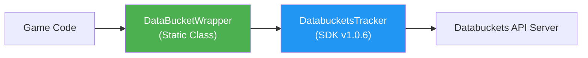
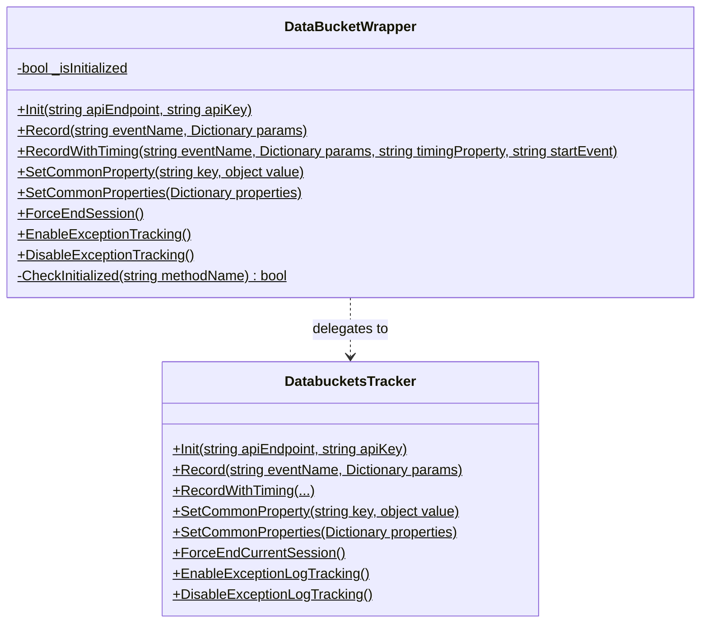
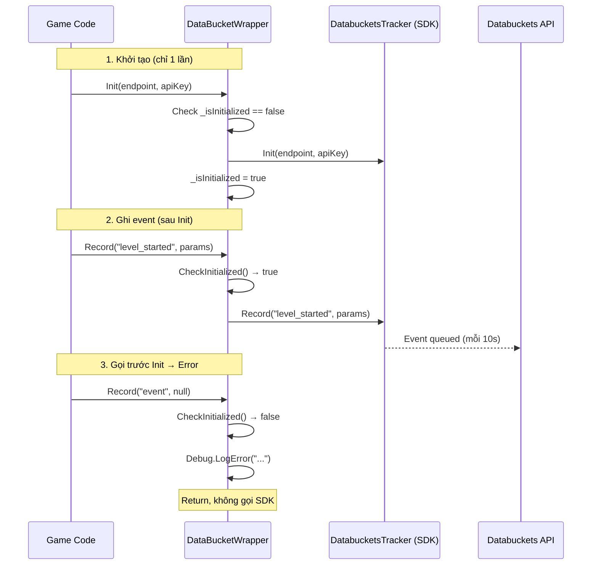

# System Design Document — DataBucketPlugin

<a id="research-arch-design-plugin-0001"></a>

`research:arch-design-plugin-0001`
> Implements: [`prd:tech-stack-0002`](../PRDs/PRD-002.md#prd-tech-stack-0002)

---

## 1. Tổng quan kiến trúc

DataBucketPlugin là một **thin wrapper layer** nằm giữa game code và Databuckets SDK, cung cấp kiểm tra Init state và error logging.



**Luồng gọi API:**
1. Game code gọi `DataBucketWrapper.Record(...)`
2. Wrapper kiểm tra `_isInitialized`
3. Nếu OK → forward sang `DatabucketsTracker.Record(...)`
4. Nếu chưa Init → `Debug.LogError(...)` và return

---

## 2. Module/Component Design

### 2.1 Cấu trúc thư mục

```
Assets/DataBucketPlugin/
├── scripts/
│   └── DataBucketWrapper.cs       ← Static wrapper class (core)
├── documents/
│   ├── README.md                  ← Hướng dẫn sử dụng
│   └── CHANGE_LOG.md              ← Lịch sử thay đổi
└── samples/
    └── DataBucketWrapperSample.cs ← MonoBehaviour test script
```

### 2.2 Class Diagram



### 2.3 Interface/Contract

| Method | Parameters | Return | Guard |
|--------|-----------|--------|-------|
| `Init` | `apiEndpoint`, `apiKey` | void | Warn nếu đã Init |
| `Record` | `eventName`, `eventParams` | void | Error nếu chưa Init |
| `RecordWithTiming` | `eventName`, `eventParams`, `timingProperty`, `startEvent` | void | Error nếu chưa Init |
| `SetCommonProperty` | `key`, `value` | void | Error nếu chưa Init |
| `SetCommonProperties` | `properties` | void | Error nếu chưa Init |
| `ForceEndSession` | — | void | Error nếu chưa Init |
| `EnableExceptionTracking` | — | void | Error nếu chưa Init |
| `DisableExceptionTracking` | — | void | Error nếu chưa Init |

---

## 3. Data Flow



---

## 4. Quy ước kỹ thuật

- **Namespace:** `DataBucketPlugin`
- **Naming:** PascalCase cho public methods, _camelCase cho private fields
- **Error Handling:** `Debug.LogError("[DataBucketWrapper] ...")` prefix thống nhất
- **Warning:** `Debug.LogWarning("[DataBucketWrapper] ...")` cho Init trùng lặp
- **Log format:** `[DataBucketWrapper] {MethodName}: {message}`

---

## 5. Rủi ro kỹ thuật

| # | Rủi ro | Impact | Likelihood | Mitigation |
|---|--------|--------|------------|------------|
| 1 | SDK gốc thay đổi API signature | H | L | Wrapper isolate thay đổi, chỉ sửa 1 file |
| 2 | Developer quên gọi Init | M | M | Wrapper tự động log error rõ ràng |
| 3 | Init state không reset khi reload scene | L | L | Đây là hành vi mong muốn — Init chỉ gọi 1 lần |

---

## 6. Danh mục Technology Stack

| Layer | Technology | Version | Lý do chọn |
|-------|------------|---------|------------|
| Language | C# | — | Unity standard |
| Engine | Unity | — | Target platform |
| SDK | Databuckets SDK | v1.0.6 | Analytics platform |
| Pattern | Static Class | — | Nhất quán với SDK gốc |
