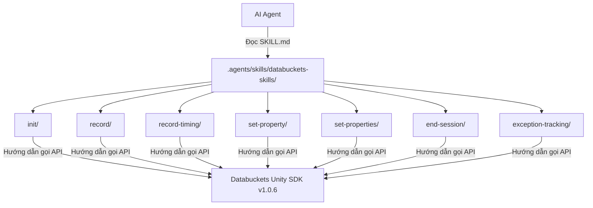
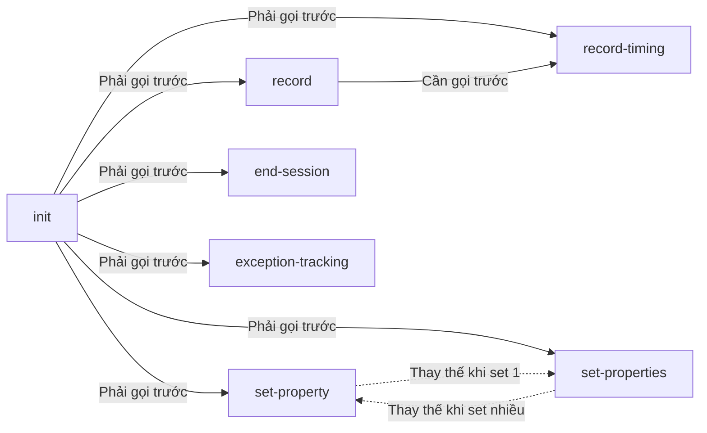

<a id="research-arch-design-0001"></a>

# System Design Document — Databuckets SDK Agent Skills

`research:arch-design-0001`
> Implements: [`prd:databuckets-sdk-skills-0001`](../PRDs/PRD-001.md#prd-databuckets-sdk-skills-0001)

---

## 1. Tổng quan kiến trúc

Dự án này tạo **bộ documentation skills** (không phải software). Kiến trúc là cấu trúc file/folder theo chuẩn `skill-creator`.



---

## 2. Module/Component Design

### 2.1 Cấu trúc thư mục

```
.agents/skills/
└── databuckets-skills/          ← Skill tổng (parent)
    ├── SKILL.md                 ← Tổng quan SDK + hướng dẫn chọn skill con
    ├── init/
    │   └── SKILL.md
    ├── record/
    │   └── SKILL.md
    ├── record-timing/
    │   └── SKILL.md
    ├── set-property/
    │   └── SKILL.md
    ├── set-properties/
    │   └── SKILL.md
    ├── end-session/
    │   └── SKILL.md
    └── exception-tracking/
        └── SKILL.md
```

> **Skill tổng** (`databuckets-skills/SKILL.md`): Giới thiệu SDK, hướng dẫn chọn skill con phù hợp, liệt kê auto-injected fields và PlayerPrefs keys.
> **Skill con** (mỗi thư mục): Hướng dẫn sử dụng 1 API cụ thể.

### 2.2 Quan hệ giữa các Skills



### 2.3 Interface/Contract (Nội dung mỗi SKILL.md)

| Skill (thư mục) | API Signature | Dependencies |
|-------|--------------|--------------|
| `init/` | `Init(apiEndpoint, apiKey)` | Không |
| `record/` | `Record(eventName, params)` | `init` |
| `record-timing/` | `RecordWithTiming(eventName, params, timingProperty, startEvent)` | `init`, `record` (cho startEvent) |
| `set-property/` | `SetCommonProperty(key, value)` | `init` |
| `set-properties/` | `SetCommonProperties(dict)` | `init` |
| `end-session/` | `ForceEndCurrentSession()` | `init` |
| `exception-tracking/` | `EnableExceptionLogTracking()` / `DisableExceptionLogTracking()` | `init` |

---

## 3. Data Flow

Không áp dụng — dự án này là documentation, không có data flow.

---

## 4. Quy ước kỹ thuật

- **Naming:** Tên skill kebab-case, prefix `databuckets-`, khớp tên thư mục
- **Ngôn ngữ viết:** Tiếng Việt cho mô tả, code samples bằng C#
- **Frontmatter:** Mỗi skill phải có `name`, `description` (dưới 150 ký tự)
- **Sections:** Theo đúng thứ tự trong `skill-creator`: Overview → When to Use → Prerequisites → Instructions → Examples → Best Practices → Anti-Patterns → Related Skills
- **Code blocks:** Luôn chỉ định `csharp`
- **QA:** Chạy QA Checklist của `skill-creator` trước khi hoàn tất mỗi skill

---

## 5. Rủi ro kỹ thuật

| # | Rủi ro | Impact | Likelihood | Mitigation |
|---|--------|--------|------------|------------|
| 1 | SDK documentation thiếu thông tin (file PDF/DOCX bị mất nội dung) | M | M | Đã extract nội dung thành công, user đã bổ sung thông tin thiếu |
| 2 | Skill quá dài/phức tạp → AI agent không parse tốt | M | L | Giới hạn Standard (300-800 từ), QA checklist kiểm tra |
| 3 | Anti-patterns không đủ thực tế | L | M | Có thể bổ sung iteratively dựa trên feedback |

---

## 6. Danh mục Technology Stack

| Layer | Technology | Version | Lý do chọn |
|-------|------------|---------|------------|
| SDK Target | Unity | 2019+ | SDK hỗ trợ Unity |
| SDK Language | C# | 7.0+ | Ngôn ngữ chính của Unity |
| Documentation | Markdown | — | Chuẩn skill-creator |
| Skill Framework | skill-creator | — | Chuẩn nội bộ dự án |
